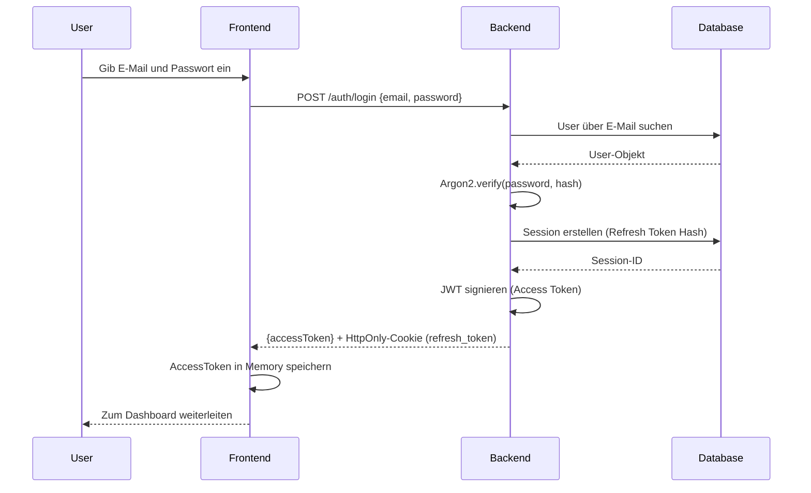
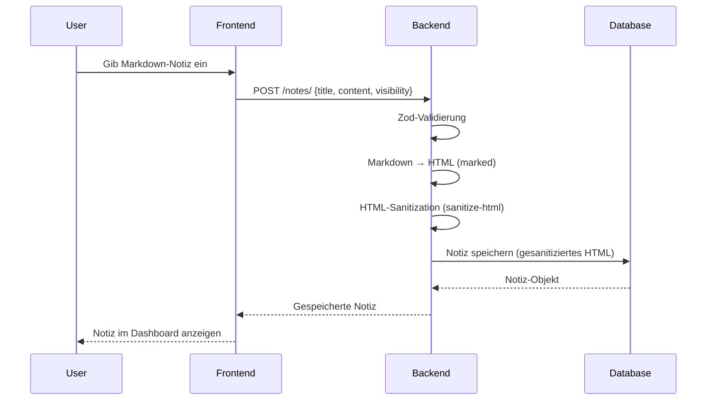
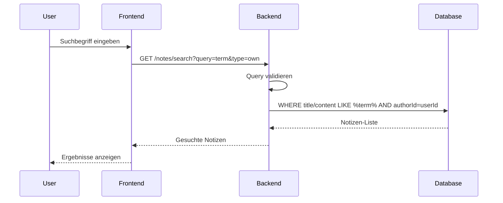

# 4. Architekturübersicht

## Gesamtarchitektur (Client-Server)

Die Anwendung folgt einer klassischen Client-Server-Architektur mit drei Ebenen:

```
┌─────────────────────────────────────────────────────────────┐
│                     Frontend (React)                        │
│              - Vite Build, Nginx Serve                      │
│              - SPA mit hash-basiertem Routing                 │
│              - Context-basierte Auth-Verwaltung              │
└──────────────────────┬──────────────────────────────────────┘
                       │ HTTPS (TLS/TLS 1.3)
                       │ - Helmet Security Headers
                       │ - CSP Whitelist
                       │ - SameSite Cookies
┌──────────────────────▼──────────────────────────────────────┐
│              Backend (Express.js + Node.js)                 │
│  - RESTful API                                             │
│  - JWT (Access) + Cookie (Refresh) Auth                   │
│  - Middleware: Rate Limiting, CSRF, Origin Guard           │
│  - Prisma ORM → PostgreSQL                                 │
└──────────┬────────────────────────────────────┬───────────┘
           │                                    │
    ┌──────▼──────┐                     ┌──────▼──────┐
    │ PostgreSQL  │                     │   Mailpit   │
    │ (Datenbank) │                     │ (SMTP Test) │
    └─────────────┘                     └─────────────┘
```

### Frontend (Client-Side)

**Technologien:**
- React 19 + TypeScript
- Vite (Build Tool)
- Tailwind CSS (Styling)
- Context API (State Management)

**Architektur-Entscheidungen:**
- **Single Page Application (SPA):** Client-Side Routing ohne Page Reloads
- **Hash-basiertes Routing:** `/#/dashboard`, `/#/note/123`
- **In-Memory Token Storage:** Access Tokens nicht in localStorage (verhindert XSS)
- **Cookie-based Refresh Tokens:** HttpOnly-Cookies für Session-Refresh

**Komponenten:**
```
src/
├── components/
│   ├── dashboard/
│   │   ├── Navbar.tsx
│   │   ├── Sidebar.tsx
│   │   ├── NoteEditor.tsx
│   │   ├── ApiKeyManager.tsx
│   │   └── PasswordResetModal.tsx
│   └── ui.tsx
├── pages/
│   ├── auth.tsx
│   ├── dashboard.tsx
│   ├── shared-note.tsx
│   └── reset-password.tsx
├── api.ts
├── auth-context.tsx
└── router.tsx
```

### Backend (Server-Side)

**Technologien:**
- Express.js 5 + TypeScript
- Node.js 20
- Prisma ORM
- PostgreSQL

**Architektur-Entscheidungen:**
- **RESTful API:** Standard HTTP-Methoden (GET, POST, PUT, DELETE)
- **Middleware-Stack:** Sicherheitsmiddleware vor Routes
- **Service Layer:** Business Logic von Controllern separiert
- **Repository Pattern:** Datenbank-Zugriffe gekapselt

**Struktur:**
```
backend/src/
├── auth/
│   ├── auth.controller.ts
│   ├── auth.service.ts
│   ├── auth.repository.ts
│   ├── password.service.ts
│   ├── token/
│   │   ├── token.service.ts
│   │   └── token.config.ts
│   └── session.repository.ts
├── notes/
│   ├── notes.controller.ts
│   ├── notes.service.ts
│   └── notes.routes.ts
├── api-keys/
│   ├── api-keys.controller.ts
│   ├── api-keys.service.ts
│   └── api-keys.routes.ts
├── shared/
│   ├── middlewares/
│   │   ├── auth.middleware.ts
│   │   ├── rateLimit.ts
│   │   ├── csrfGuard.ts
│   │   └── originGuard.ts
│   └── services/
│       └── mailService.ts
└── index.ts
```

## Vertrauensgrenzen (Trust Boundaries)

### 1. Browser/Client → Internet

**Zone:** Unvertrauenswürdig

**Annahmen:**
- Alle Eingaben aus dem Browser sind potenziell gefährlich
- Client-Code kann manipuliert werden
- Cookies können durch XSS gestohlen werden

**Schutzmaßnahmen:**
- Alle Validierungen auf Server-Side
- HttpOnly-Cookies (nicht via JavaScript zugreifbar)
- SameSite-Attribute (Lax für Auth-Cookies)
- Secure-Flag (nur HTTPS) in Produktion

### 2. Frontend (Nginx) → Backend

**Zone:** Semi-vertrauenswürdig

**Annahmen:**
- Frontend kann manipuliert werden (nicht vertrauenswürdig)
- Frontend-Auth-Cookies sind vertrauenswürdig (via HttpOnly)

**Schutzmaßnahmen:**
- HTTPS-verschlüsselte Verbindung
- CORS-Whitelist (nur vertrauenswürdige Origins)
- Origin Guard Middleware (Origin/Referer Validierung)
- CSP-Header (Content Security Policy)

### 3. Backend → Datenbank

**Zone:** Vertrauenswürdig

**Annahmen:**
- Backend ist vertrauenswürdiger Endpoint
- Nur Backend hat Zugriff auf Datenbank

**Schutzmaßnahmen:**
- Docker-Netzwerk-Isolation (keine direkte Verbindung nach außen)
- Database-Credentials via Environment-Variablen
- Prisma ORM (automatische SQL-Injection-Schutz)

### 4. Backend → SMTP

**Zone:** Produktion: Vertrauenswürdig, Entwicklung: Mailpit (lokal)

**Annahmen:**
- Produktion: SMTP-Server ist vertrauenswürdig
- Entwicklung: Mailpit ist nur für Test-Zwecke

**Schutzmaßnahmen:**
- SMTP-Credentials via Environment-Variablen
- TLS-verschlüsselte Verbindung (Produktion)
- Mailpit nur in lokaler Umgebung

## Datenflüsse

### Authentifizierungs-Datenfluss



### Notiz-Erstellung



### Suche



## Sicherheitsannahmen

### 1. HTTPS wird in Produktion vorausgesetzt

**Annahme:** Alle sicherheitsrelevanten Cookies sind auf `secure: true` konfiguriert.

**Implementierung:**
```typescript
const isProd = process.env.NODE_ENV === "production";

res.cookie(REFRESH_COOKIE_NAME, token, {
  httpOnly: true,
  secure: isProd,  // Nur HTTPS in Produktion
  sameSite: "lax",
  path: "/auth/refresh",
  maxAge: REFRESH_TOKEN_TTL_SECONDS * 1000,
});
```

### 2. Datenbank ist isoliert

**Annahme:** Nur Backend-Container kann auf PostgreSQL zugreifen.

**Implementierung:**
```yaml
# docker-compose.yml
postgresql:
  image: postgres:alpine
  # Kein Port-Mapping in Produktion
  # ports:
  #   - "5432:5432"  # Nur für Entwicklung
  networks:
    - securenotes-net

backend:
  depends_on:
    - postgresql
  networks:
    - securenotes-net
```

### 3. JWT Secret ist sicher

**Annahme:** JWT Secret ist nicht im Code enthalten.

**Implementierung:**
```bash
# .env
JWT_SECRET=your_secure_secret_minimum_32_characters
```

```typescript
// token.service.ts
const JWT_SECRET = process.env.JWT_SECRET;
if (!JWT_SECRET) throw new Error("JWT_SECRET is missing");
const jwtKey = new TextEncoder().encode(JWT_SECRET);
```

### 4. Frontend-Code ist öffentlich

**Annahme:** Alle Client-seitigen Sicherheitsentscheidungen können umgangen werden.

**Konsequenz:**
- Alle Validierungen auch auf Server-Side
- Keine sensitiven Daten im Frontend-Code
- Alle Sicherheitschecks im Backend

### 5. SMTP-Konfiguration ist vertrauenswürdig

**Annahme:** E-Mail-Provider ist vertrauenswürdig und Credentials sind sicher.

**Implementierung:**
- Mailpit nur für Entwicklung
- Produktion: vertrauenswürdiger Provider (SendGrid, SES, etc.)
- SMTP-Credentials via Environment-Variablen

## Netzwerk-Topologie

### Entwicklungsumgebung

```
┌─────────────────────────────────────────────┐
│               Host-Maschine                │
│  - Browser (Frontend: localhost)          │
│  - Docker Daemon                         │
└─────────────────┬───────────────────────┘
                  │
┌─────────────────▼───────────────────────┐
│         Docker Bridge Network             │
│  ┌──────────────┬──────────────┬──────┐│
│  │ Frontend:80  │ Backend:3000 │ PG:5 ││
│  │    ↓         │    ↓         │  ↓   ││
│  │  localhost   │  localhost  │  ... ││
│  └──────────────┴──────────────┴──────┘│
└───────────────────────────────────────────┘
```

### Produktionsumgebung (empfohlen)

```
┌─────────────────────────────────────────────┐
│              Internet                     │
└─────────────────┬───────────────────────┘
                  │ HTTPS
┌─────────────────▼───────────────────────┐
│           Reverse Proxy (Nginx)          │
│  - SSL Termination                      │
│  - Static Files (Frontend)               │
│  - Proxy to Backend                     │
└─────────────────┬───────────────────────┘
                  │ Internal Network
┌─────────────────▼───────────────────────┐
│           Backend-Container              │
│  - Express.js API                       │
│  - Internal DB Connection               │
└─────────────────┬───────────────────────┘
                  │ Docker Network
┌─────────────────▼───────────────────────┐
│         PostgreSQL Container             │
│  - No external exposure                │
└───────────────────────────────────────────┘
```

## Nächste Schritte

- [Sicherheitskonzept](5-sicherheitskonzept.md) - Detaillierte Sicherheitsmaßnahmen
