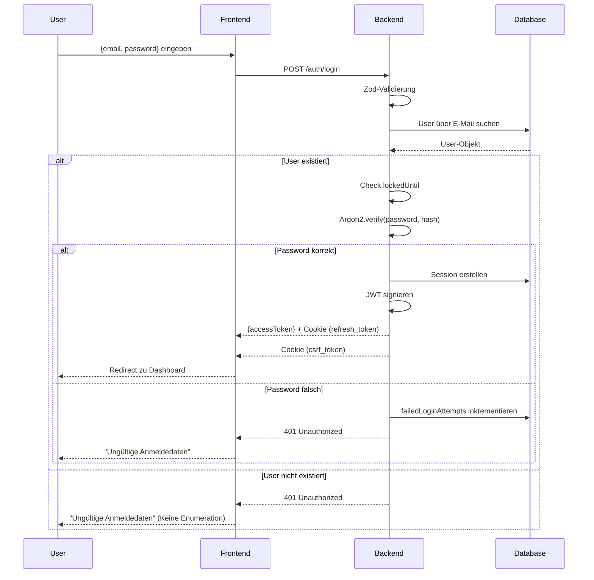
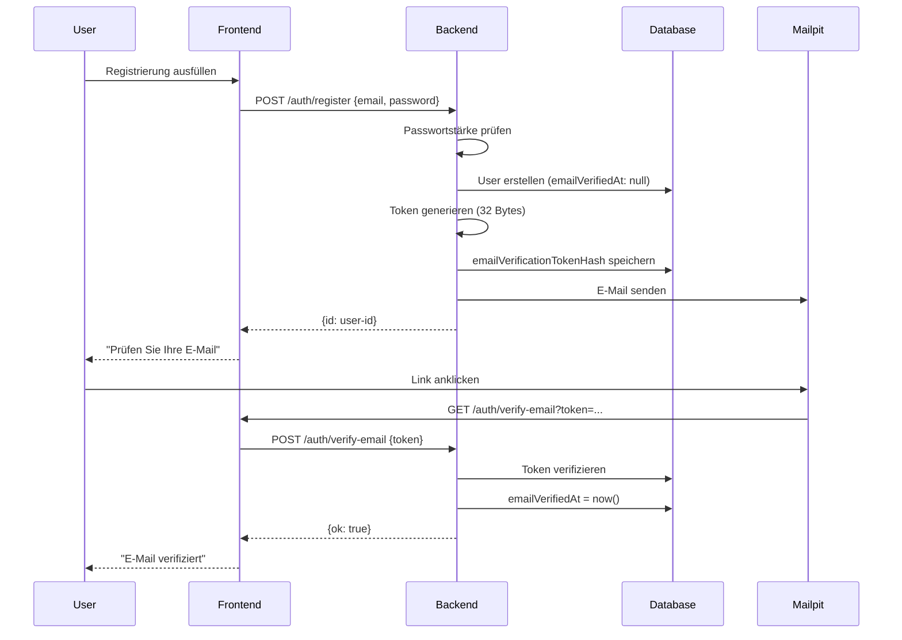

# 5. Sicherheitskonzept (Kernkapitel)

## Übersicht

Das Sicherheitskonzept von SecureNotes basiert auf Defense-in-Depth und Security-by-Design-Prinzipien. Jede Schicht der Anwendung implementiert Sicherheitsmaßnahmen, die unabhängig voneinander funktionieren und ineinandergreifen.

### Security-Layer

```
┌─────────────────────────────────────────────────┐
│  Layer 1: Network Security (HTTPS, TLS)     │
├─────────────────────────────────────────────────┤
│  Layer 2: Application Security (CSP, CORS)   │
├─────────────────────────────────────────────────┤
│  Layer 3: Authentication & Authorization      │
├─────────────────────────────────────────────────┤
│  Layer 4: Input Validation & Sanitization    │
├─────────────────────────────────────────────────┤
│  Layer 5: Output Encoding                   │
└─────────────────────────────────────────────────┘
```

---

## 5.1 Authentifizierung

### Login-Mechanismus

SecureNotes implementiert eine hybride Authentifizierung mit **JWT Access Tokens** (stateless) und **Refresh Tokens** (stateful).

#### Login-Ablauf



#### Token-Struktur

**Access Token (JWT):**
```json
{
  "header": {
    "alg": "HS256",
    "typ": "JWT"
  },
  "payload": {
    "sub": "user-id-uuid",
    "sid": "session-id-uuid",
    "iat": 1234567890,
    "exp": 1234573890
  },
  "signature": "HMAC-SHA256(base64urlEncode(header) + "." + base64urlEncode(payload))"
}
```

- **Algorithm:** HS256 (HMAC with SHA-256)
- **TTL:** 10 Minuten
- **Payload:** User-ID (`sub`), Session-ID (`sid`)
- **Signature:** Mit JWT Secret signiert

**Refresh Token (Cookie):**
- Storage: HttpOnly-Cookie
- Format: Base64URL-encodet (48 Bytes)
- Database: SHA256-gehashed
- TTL: 7 Tage

### Passwort-Hashing

#### Algorithmus: Argon2id

Argon2id wurde vom Password Hashing Competition 2015 zum Gewinner gekürt und ist resistenter gegen GPU/ASIC-Brute-Force als bcrypt oder scrypt.

#### Konfiguration

```typescript
{
  type: argon2.argon2id,
  memoryCost: 19456,    // ~19 MB RAM pro Hash
  timeCost: 2,           // 2 Iterationen
  parallelism: 1         // 1 Thread
}
```

#### Hash-Format

```
$argon2id$v=19$m=19456,t=2,p=1$[salt]$[hash]
```

**Beispiel:**
```
$argon2id$v=19$m=19456,t=2,p=1$YWJjZGVmZ2hpams$U0FNRXZhbGlkSGFzaEV4YW1wbGVWZXJ5bG9uZ2hhc2h2YWx1ZQ==
```

- **v=19:** Argon2 Version 19
- **m=19456:** Memory Cost (19 MB)
- **t=2:** Time Cost (2 Iterationen)
- **p=1:** Parallelism (1 Thread)
- **salt:** 16-Byte random salt (Base64URL-encodet)
- **hash:** 32-Byte hash output (Base64URL-encodet)

#### Salt

- **Länge:** 16 Bytes (128 Bits)
- **Generierung:** Automatisch durch Argon2
- **Eindeutigkeit:** Jeder Hash hat einzigartiges Salt

#### Sicherheitsevaluation

| Angriffsvektor | Argon2id-Schutz |
|----------------|-----------------|
| Brute-Force (CPU) | Hoch (timeCost: 2) |
| Brute-Force (GPU) | Sehr hoch (memoryCost: 19456) |
| Brute-Force (ASIC) | Sehr hoch (memory-hard) |
| Rainbow Tables | Unmöglich (unique salt) |
| Dictionary Attacks | Hoch (Entropie + timeCost) |

### Schutz vor Brute-Force und Enumeration

#### Rate Limiting

**Globaler Rate Limiter:**
```typescript
createRateLimiter({
  windowMs: 15 * 60 * 1000,  // 15 Minuten
  max: 100  // 100 Requests pro 15 Minuten
})
```

**Auth-Endpunkte:**
```typescript
createRateLimiter({
  windowMs: 60 * 1000,  // 1 Minute
  max: 10  // 10 Requests pro Minute
})
```

#### Account Lockout

```typescript
MAX_FAILED_ATTEMPTS = 10
LOCK_MS = 15 * 60 * 1000  // 15 Minuten
```

**Implementierung:**
```typescript
if (!passwordValid) {
  const failed = (user.failedLoginAttempts ?? 0) + 1;
  const shouldLock = failed >= MAX_FAILED_ATTEMPTS;
  
  await authRepository.updateLoginFailure(user.id, {
    failedLoginAttempts: failed,
    lockedUntil: shouldLock ? new Date(Date.now() + LOCK_MS) : null
  });
  
  throw AuthError.unauthorized("INVALID_CREDENTIALS");
}
```

#### Enumeration Protection

**Prinzip:** Keine Unterscheidung zwischen "User nicht existiert" und "Falsches Passwort".

```typescript
// Falsche E-Mail
if (!user) {
  throw AuthError.unauthorized("INVALID_CREDENTIALS");  // Gleiche Nachricht
}

// Falsches Passwort
if (!passwordValid) {
  throw AuthError.unauthorized("INVALID_CREDENTIALS");  // Gleiche Nachricht
}
```

**Passwort-Reset:**
```typescript
// E-Mail existiert nicht
if (!user || !user.isActive) {
  return { ok: true as const };  // Keine Differenzierung
}
```

### Fehlerbehandlung

#### AuthError-Klasse

```typescript
export class AuthError extends Error {
  constructor(
    public code: string,
    public status: number
  ) {
    super(code);
  }
  
  static unauthorized(code: string) {
    return new AuthError(code, 401);
  }
  
  static conflict(code: string) {
    return new AuthError(code, 409);
  }
}
```

#### Logging

```typescript
if (error instanceof AuthError) {
  console.log(`Auth error: ${error.code} for IP: ${req.ip}`);
  res.status(error.status).json({ ok: false });
  return;
}

console.error("Unexpected error:", error);
res.status(500).json({ ok: false });
```

**Keine Stack Traces in Responses** - Nur Logging auf Server-Seite für Forensik.

---

## 5.2 Registrierung

### Passwortstärke

#### Validierung-Ebenen

**1. Zod-Schema (syntaktisch):**

```typescript
export const passwordSchema = z
  .string()
  .min(8, { message: "Mindestens 8 Zeichen" })
  .max(64, { message: "Höchstens 64 Zeichen" })
  .refine(/[A-Z]/, { message: "Mindestens ein Großbuchstabe" })
  .refine(/[a-z]/, { message: "Mindestens ein Kleinbuchstabe" })
  .refine(/[0-9]/, { message: "Mindestens eine Zahl" })
  .refine(/[-+!@#$%^&*]/, { message: "Mindestens ein Sonderzeichen" });
```

**2. zxcvbn (semantisch):**

```typescript
zxcvbn(password, [email]).score >= 3  // Scale 0-4
```

**Bewertungsskala:**
- 0: Sehr schwach (kann sofort erraten werden)
- 1: Schwach (kann in Minuten erraten werden)
- 2: Mittel (kann in Stunden/Tagen erraten werden)
- 3: Stark (kann in Monaten/Jahren erraten werden)
- 4: Sehr stark (kann in Jahrzehnten erraten werden)

**Erkannte Patterns:**
- Wörterbücher (deutsch, englisch)
- Tastatur-Muster (qwerty, asdf, 1234)
- Häufige Passwörter (password123, admin123)
- Benutzerspezifische Eingaben (E-Mail, Name)
- Wiederholte Muster (aaaaaa111!!)
- Sequenzielle Zeichen (Abcdef12!)

### E-Mail-Verifikation

#### Ablauf



#### Token-Sicherheit

**Generierung:**
```typescript
const tokenPlain = crypto.randomBytes(32).toString("hex");
const tokenHash = tokenService.hashToken(tokenPlain);
// Speichere nur hashToken in DB
```

**Format:**
- Länge: 64 hexadezimale Zeichen (256 Bits)
- Speicherung: SHA256-gehashed
- Gültigkeit: Kein Ablaufdatum (durch Logik impliziert)

### Schutz vor Missbrauch

#### Disposable E-Mail Block

```typescript
import { isDisposableEmail } from "disposable-email-domains-js";

export const emailSchema = z
  .string()
  .trim()
  .toLowerCase()
  .pipe(z.email({ message: "Ungültige E-Mail-Adresse" }))
  .refine(
    (email) => {
      return !isDisposableEmail(extractDomain(email));
    },
    {
      message: "Ungültige E-Mail-Adresse.",
    }
  );
```

**Blockierte Domains:**
- guerrillamail.com
- mailinator.com
- 10minutemail.com
- temp-mail.org
- ... (über 10.000 Domains)

#### Rate Limiting

```typescript
// Registrierung
router.post("/register",
  createRateLimiter({ windowMs: 60 * 1000, max: 10 }),
  createAuthHandler
);

// E-Mail Resend
router.post("/resend-verification",
  createRateLimiter({ windowMs: 60 * 1000, max: 10 }),
  resendVerificationHandler
);
```

#### OAuth-Fallback

Google OAuth-Benutzer haben automatisch `emailVerifiedAt` gesetzt, da Google E-Mails verifiziert.

---

## 5.3 Autorisierung

### Durchsetzung für alle HTTP-Endpunkte

#### Auth Middleware

```typescript
export async function authMiddleware(
  req: Request,
  res: Response,
  next: NextFunction
): Promise<void | Response> {
  // 1. API Key Check (Header: x-api-key)
  const apiKey = req.get("x-api-key");
  if (apiKey) {
    const user = await validateApiKey(apiKey);
    if (user) {
      req.user = { id: user.id };
      return next();
    }
    return res.status(401).json({ ok: false, message: "Invalid API Key" });
  }

  // 2. JWT Check (Header: Authorization: Bearer <token>)
  const authHeader = req.get("authorization");
  if (!authHeader?.startsWith("Bearer ")) {
    return res.status(401).json({ ok: false });
  }

  const token = authHeader.slice(7);

  try {
    const { payload } = await jwtVerify(token, jwtKey);
    const userId = payload.sub as string;
    const sessionId = payload.sid as string;

    req.auth = { userId, sessionId };
    req.user = { id: userId };

    next();
  } catch {
    return res.status(401).json({ ok: false });
  }
}
```

#### Geschützte Routen

```typescript
// notes.routes.ts
const router = Router();
router.use(authMiddleware);  // Alle Routen geschützt

router.get("/", getAllNotesHandler);
router.post("/", createNoteHandler);
router.get("/search", searchNotesHandler);
router.get("/:id", getNoteByIdHandler);
router.put("/:id", updateNoteHandler);
router.delete("/:id", deleteNoteHandler);
```

### Zugriff auf private vs. öffentliche Notizen

#### Filter-Logik

```typescript
export const getAllNotes = async (userId: string, filterType?: string) => {
  let whereCondition: Prisma.NoteWhereInput;

  if (filterType === "own") {
    // Nur Users eigene Notizen (PUBLIC oder PRIVATE)
    whereCondition = { authorId: userId };
  } else if (filterType === "public") {
    // Nur PUBLIC Notizen (egal wessen)
    whereCondition = { visibility: NoteVisibility.PUBLIC };
  } else {
    // Default: Users eigene ODER alle PUBLIC
    whereCondition = {
      OR: [
        { visibility: NoteVisibility.PUBLIC },
        { visibility: NoteVisibility.PRIVATE, authorId: userId }
      ],
    };
  }

  return await prisma.note.findMany({
    where: whereCondition,
    select: {
      id: true,
      title: true,
      createdAt: true,
      updatedAt: true,
      visibility: true,
    },
    orderBy: { createdAt: "desc" },
  });
};
```

#### Notiz-Modification

```typescript
export const updateNote = async (
  id: string,
  input: UpdateNoteInput,
  userId: string
) => {
  // Prüfe ob Notiz existiert
  const note = await prisma.note.findUnique({ where: { id } });
  if (!note) return null;

  // Prüfe ob User Owner ist
  if (note.authorId !== userId) {
    return null;  // Keine Details darüber, warum Zugriff verweigert
  }

  const updatedNote = await prisma.note.update({
    where: { id },
    data: input,
  });

  return { ...updatedNote, htmlContent: sanitized };
};
```

### Link-basierter Zugriff (document_id)

Öffentliche Notizen können über direkten Link geteilt werden.

**Frontend-Route:** `/#/note/{noteId}`

**Backend-Check:**
```typescript
export const getNoteById = async (id: string, userId?: string) => {
  if (!userId) {
    return null;  // Anonyme Zugriffe abgewiesen
  }

  const note = await prisma.note.findUnique({ where: { id } });
  if (!note) return null;

  // Wenn PUBLIC: Für alle authentifizierten Users lesbar
  // Wenn PRIVATE: Nur für Owner
  const parsedContent = await parserMarkdown(note.content);
  const sanitizedContent = sanitizeMarkdown(parsedContent);

  return { ...note, htmlContent: sanitizedContent };
};
```

**Sicherheitsannahme:** Nur authentifizierte Users können Notizen lesen. Anonyme Zugriffe sind nicht möglich.

---

## 5.4 Eingabevalidierung & Output-Encoding

### Schutz vor XSS

**Frontend (React):**
- React escaping standardmäßig aktiv für JSX-Variables
- Nur `dangerouslySetInnerHTML` für gesanitized HTML
- Trusted Content wird explizit markiert

**Backend-Sanitization-Flow:**
```typescript
// 1. Markdown Parsing
const parsedContent = await parserMarkdown(note.content);

// 2. HTML Sanitization
const sanitizedContent = sanitizeMarkdown(parsedContent);

// 3. Storage in DB
// 4. Frontend receives htmlContent
```

### Schutz vor Injection

**SQL Injection:**
- **Prisma ORM:** Alle Queries sind automatisch parametrisiert
- Keine manuellen SQL-Queries mit String-Konkatenation
- TypeScript-Types verhindern untypisierte Inputs

**Command Injection:**
- Kein direkter System-Befehlsaufruf aus User-Input
- Alle externen Commands sind statisch

### Umgang mit User-Input

#### Validierung-Layer

**1. Zod-Schemas (Runtime):**

```typescript
export const createNoteSchema = z.object({
  title: z.string().max(200).optional(),
  content: z.string().max(1000000),  // Max 1 MB
  visibility: z.nativeEnum(NoteVisibility)
});
```

**2. TypeScript (Compile-time):**
- Alle Request/Response-Typen definiert
- `req.body` wird typisiert geparst

**3. Trimming:**
- E-Mail: `.trim().toLowerCase()`
- Strings werden getrimt vor Validierung

#### Output-Sanitization

**sanitize-html Konfiguration:** (siehe Abschnitt 5.5)

---

## 5.5 Markdown & HTML

### Verwendeter Markdown-Parser

**marked 17.0.1**

- Schnell, konform zu CommonMark-Spezifikation
- Unterstützt: Headers, Lists, Code Blocks, Tables, Links, Images

#### Custom Renderer für YouTube

```typescript
renderer.image = ({ href, text }) => {
  if (href && href.startsWith("embed:")) {
    const videoId = extractYouTubeId(href);
    return `<iframe src="https://www.youtube.com/embed/${videoId}"></iframe>`;
  }
  return ``;
};
```

**Syntax:** ``

### HTML-Unterstützung und deren Risiken

#### Erlaubte Tags

```typescript
allowedTags: sanitizeHtml.defaults.allowedTags.concat([
  "h1", "h2", "h3", "h4", "h5", "h6",
  "p", "br", "img", "iframe", "div"
])
```

**Text-Formatierung:** `strong`, `em`, `code`, `pre`
**Listen:** `ul`, `ol`, `li`
**Links:** `a` (nur `href`, `title`, `target`)
**Bilder:** `img` (nur `src`, `alt`, `title`, `width`, `height`)
**Embeds:** `iframe` (nur YouTube-Domains)

#### Risiken

| Risiko | Schutzmaßnahme |
|--------|---------------|
| `<script>` Tags | Entfernt durch sanitize-html |
| Event-Handler (`onclick`) | Alle `on*` Attribute entfernt |
| `javascript:` Protocol | Blockiert durch scheme-whitelist |
| Data-Attributes | Alle `data-*` Attribute entfernt |

### Sanitization-Strategie

#### sanitize-html Konfiguration

```typescript
{
  allowedTags: [...defaults, "h1-h6", "p", "br", "img", "iframe", "div"],
  allowedAttributes: {
    img: ["src", "alt", "title", "width", "height"],
    a: ["href", "title", "target"],
    iframe: ["src", "title", "width", "height", "allow", "allowfullscreen", "sandbox"]
  },
  allowedSchemes: ["http", "https", "mailto", "tel", "ftp"],
  allowedIframeHostnames: ["www.youtube.com", "youtu.be", "youtube.com"],
  transformTags: {
    "*": (tagName, attribs) => {
      // Entferne data-* und on* Attribute
      const cleanAttribs = {};
      for (const key in attribs) {
        if (!key.startsWith("data-") && !key.toLowerCase().startsWith("on")) {
          cleanAttribs[key] = attribs[key];
        }
      }
      return { tagName, attribs: cleanAttribs };
    },
    iframe: (tagName, attribs) => {
      if (attribs.src?.startsWith("javascript:")) {
        return { tagName: "", attribs: {} };  // Entferne iframe
      }
      return {
        tagName,
        attribs: {
          ...attribs,
          sandbox: attribs.sandbox || "allow-scripts allow-same-origin"
        }
      };
    }
  }
}
```

### iFrame-Embedding (YouTube)

#### Whitelist-Domains
- `www.youtube.com`
- `youtube.com`
- `youtu.be`

#### Sandbox-Attribute
- `allow-scripts`: Für Video-Playback notwendig
- `allow-same-origin`: Für Einbindung
- Keine anderen Permissions

#### CSP-Richtlinie

```javascript
frameSrc: [
  "https://www.youtube.com",
  "https://www.youtube-nocookie.com",
  "https://youtu.be"
]
```

---

## 5.6 Suche

### Umgang mit Query-Parametern

**Endpoint:** `GET /notes/search?query=term&type=own|public`

#### Validierung

```typescript
if (typeof query !== "string") {
  res.status(400).json({ message: "Invalid search term." });
  return;
}

const trimmedQuery = query.trim();
if (!trimmedQuery) {
  res.status(200).json([]);
  return;
}
```

#### SQL-Like Query

```typescript
const searchCondition = {
  OR: [
    { title: { contains: query, mode: "insensitive" } },
    { content: { contains: query, mode: "insensitive" } }
  ]
};
```

**Prisma-Parameter:** Query ist automatisch parametrisiert → keine SQL-Injection möglich.

### Sicherheitsmaßnahmen

#### Visibility Enforcement

```typescript
if (filterType === "own") {
  visibilityCondition = { authorId: userId };
} else if (filterType === "public") {
  visibilityCondition = { visibility: NoteVisibility.PUBLIC };
} else {
  visibilityCondition = {
    OR: [
      { visibility: NoteVisibility.PUBLIC },
      { visibility: NoteVisibility.PRIVATE, authorId: userId }
    ]
  };
}
```

### Datenschutzaspekte

**Such-Log:**
- Kein Logging von Such-Queries (Privacy-by-Design)
- Keine Analyse von Suchmustern

**Such-Index:**
- Kein dedizierter Such-Index
- Nutzt DB `LIKE` Queries
- Performance trade-off vs. Privacy (keine User-Profiling-Daten)

---

## Nächste Schritte

- [Datenschutz](6-datenschutz.md) - DSGVO-relevante Überlegungen
